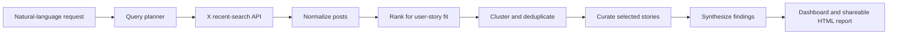

# BioAI FieldNotes

BioAI FieldNotes is a local single-user dashboard for on-demand 7-day scans
across X. It collects posts, selects story clusters that look like concrete
use cases rather than generic keyword mentions, ranks them with relative
scientific-domain signals, deduplicates reposted or linked variants into one
story, and gates LLM summaries behind an estimated cost cap. Customer-facing
reports group selected posts as user-experience stories and can include a brief
top-level synthesis.

## System Flow

## Quick Start

Create a local Python environment, install the package with development
dependencies, configure required environment variables in a private `.env`, and
start the FastAPI app with Uvicorn. Keep `.env` local and never commit API keys.

The app reads `.env` from the project root. To use another secret file, set
`BIOAI_ENV_PATH=/path/to/.env` before starting the server.

The CLI mirrors the dashboard scan path. Prefer `--prompt`; manual keywords are
optional seed terms for the query planner. For story prompts, the planner
separates target model/product terms from usage cues and domain context.

If the first pass does not find enough likely user-experience stories, the scan
automatically runs a second X query that drops the domain preference and focuses
on first-person/workflow cues such as "I used", "we built", and "my workflow".
The final ranking still keeps biomedical/public-health context as a bonus, but
does not let that preference hide better general user stories.

Clusters merge posts that share any external URL and also merge near-duplicate
story captions, while ignoring plain X/Twitter status links that often point to
generic launch posts rather than the user story itself.

## Cost Controls

LLM summaries are blocked unless pricing can be loaded. Set
`BIOAI_MODELPRICES_PATH` to a JSON file or directory from your model price repo.
For local development only, pass `--allow-fallback-pricing` or enable the
dashboard checkbox to use `configs/fallback_model_prices.json`.

If `OPENAI_API_KEY` is not set, the scan still collects, ranks, clusters, and
records summary rows as skipped.

## Environment

The app loads `.env` from the project root and never writes secrets to SQLite.
Shell environment variables take precedence over `.env` values.

- `X_BEARER_TOKEN`: required for X scans.
- `BIOAI_DB_PATH`: optional SQLite path, defaults to `data/bioai_fieldnotes.sqlite3`.
- `BIOAI_LLM_PROVIDER`: currently `openai` or `none`, defaults to `openai`.
- `BIOAI_LLM_MODEL`: defaults to `gpt-5-mini`.
- `BIOAI_QUERY_PLANNER_MODEL`: optional cheaper model for prompt-to-keyword planning.
- `BIOAI_MODELPRICES_PATH`: JSON/CSV file or directory with model prices.
- `BIOAI_ALLOW_FALLBACK_PRICING`: set to `1` to allow development fallback prices.

M1 intentionally does not implement recurring reviews, paper sources, cron setup,
or hosted auth.
